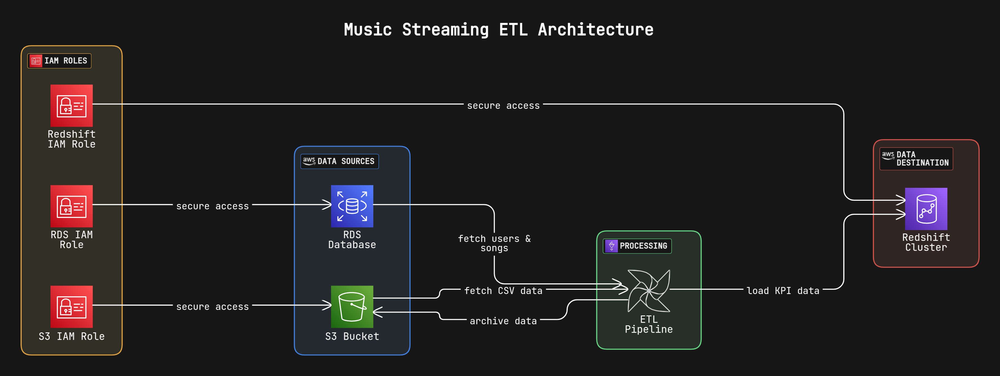

# Music Streaming ETL Pipeline

## Overview
This project implements an end-to-end data pipeline for a music streaming service using Apache Airflow. The pipeline integrates data from multiple sources (AWS RDS and S3), processes it, and generates key performance indicators (KPIs) for business intelligence.

## Key Features
- **Batch processing** of large datasets
- **Comprehensive error handling**
- **Dynamic workflow** based on data availability
- **Data archiving** to avoid reprocessing
- **Scalable architecture** using AWS services
- **Automated data ingestion** from RDS and S3
- **Data validation** to ensure integrity
- **KPI Computation**:
  - **Genre-Level KPIs:** Listen Count, Average Track Duration, Popularity Index, Most Popular Track per Genre
  - **Hourly KPIs:** Unique Listeners, Top Artists per Hour, Track Diversity Index
- **Efficient loading** into Amazon Redshift
- **Logging and monitoring** capabilities

## Data Schema

### Users Table
| Column Name | Type | Description |
|-------------|------|-------------|
| User Name | Text | Name of user |
| User Age | Integer | Age of user |
| User Country | Text | User's country |
| Created at | Text | Account creation time |

### Songs Table  
| Column Name | Type | Description |
|-------------|------|-------------|
| Track id | Text | Track identifier |
| Artists | Text | Artist name |
| Album Name | Text | Album name |
| Track Name | Text | Song name |
| Popularity | Integer | Track popularity |
| Duration ms | Integer | Track duration |
| Track Genre | Text | Music genre |

### Streams Table
| Column Name | Type | Description |
|-------------|------|-------------|
| User ID | Integer | User identifier |
| Track ID | Text | Track identifier |
| Listen Time | Timestamp | Stream start time |

## Pipeline Workflow
1. Check RDS Data availability
2. Fetch RDS Users and Songs in batches
3. Check and fetch S3 streaming data  
4. Merge all data sources
5. Compute KPIs (genre-level and hourly)
6. Load results to Redshift
7. Archive processed data

## Technology Stack
- **Apache Airflow** (DAG orchestration)
- **Amazon S3** (Streaming data storage)
- **Amazon RDS** (Metadata source)
- **Amazon Redshift** (Data warehouse)
- **Python** (Data processing)
- **Pandas** (Data manipulation)
- **Psycopg2** (PostgreSQL/Redshift connector)

## Setup Instructions
1. Configure Airflow connections:
   - `aws_rds_connection` for RDS access
   - `aws_conn` for S3 access  
   - `redshift_conn` for Redshift access
2. Set environment variables for credentials
3. Deploy Airflow DAG (`music_streaming_pipeline.py`)

## Future Enhancements
- Incremental data processing
- Data validation steps  
- Alerting integration (Slack/PagerDuty)
- Dashboard visualization (Tableau/QuickSight)

